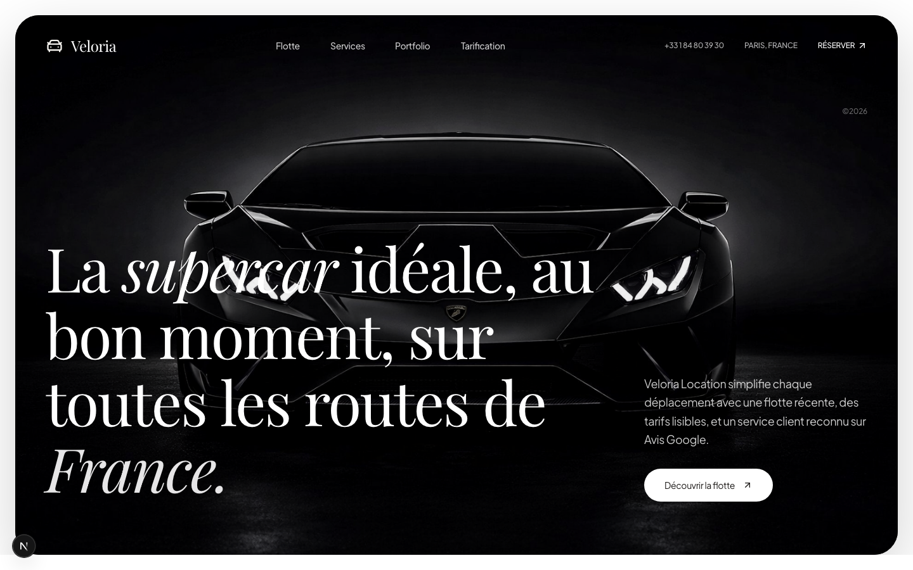

# location-voiture

Demo website created to showcase a fictional car rental business.

## Preview



## Purpose

This project was designed as a client presentation piece to showcase a premium visual direction, a clear interface, and a simple booking journey.

## Includes

- offer presentation page
- vehicle and service highlights
- trust, pricing, and contact sections

## Stack

- Next.js
- React
- TypeScript

## Run locally

```bash
npm install
npm run dev
```

The site will be available on the port configured in the project.

## Note

This is a demo website built to present frontend quality and a polished commercial presentation style.

If you like this project and want to use it, please leave a star on the repository.
